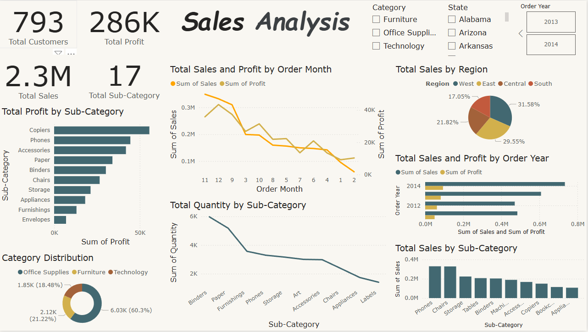

# Sales Analysis Dashboard

A professional Sales Analysis Dashboard built using Power BI to analyze business performance across different regions, categories, sub-categories, and years.

---

#  Project Overview

This dashboard provides interactive visual insights into:

- Total Sales
- Total Profit
- Customer Distribution
- Regional Performance
- Sales Trends Over Time
- Category & Sub-Category Analysis

The project helps businesses make data-driven decisions by identifying:
- Best-selling products
- Most profitable categories
- High-performing regions
- Sales growth trends

---

#  Tools & Technologies

-  Power BI
-  DAX
-  Data Visualization
-  Business Intelligence
-  Data Analysis

---

#  Dashboard Features

##  KPI Cards
- Total Sales
- Total Profit
- Total Customers
- Total Sub-Categories

##  Sales & Profit Analysis
Track sales and profit performance by:
- Month
- Year
- Region

##  Category Analysis
Analyze:
- Furniture
- Office Supplies
- Technology

##  Sub-Category Insights
Identify top-performing sub-categories such as:
- Copiers
- Phones
- Accessories

##  Interactive Filters
Dynamic slicers for:
- Category
- State
- Order Year

---

#  Dashboard Preview



---

#  Key Insights

-  West region generated the highest sales.
-  2014 achieved the highest sales performance.
-  Copiers produced the highest profit.
-  Office Supplies represented the largest category distribution.

---

#  Project Structure

```bash
Sales-Analysis-Dashboard/
│
├── dashboard.pbix
├── dashboard.png
└── README.md
